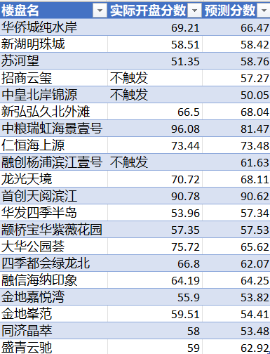

# 上海新房积分探秘 （一）：积分预测

## 简介

2021年上海购房市场引入了积分制这一重大变革。积分制会根据户口、婚姻状况、社保缴纳月份、名下是否有房产为购房者计算积分。对于认购火爆的楼盘，积分在前一部分的购房者才有资格参与摇号。

与此同时，规定限制同一个购房家庭事实上在6~8周时间内最多只能认购1套楼盘。

购房者只要参与认筹，无论是否入围都会被锁定购房名额。因此，购房者在参与认筹之前，判定清楚自己是否有资格入围就显得尤为重要，正确判断积分能否入围可以节约大量时间及资金成本。

基于此类需要，作者现将自己使用的购房积分测算工具公布，以供读者参考。读者可自由使用于非商业用途。

本文构成如下：首先介绍上海积分制认购规则，随后介绍数据收集整理过程，接着通过线性模型测算积分，并介绍各特征因子对结果的影响。

文中所有数据及源代码附于作者GitHub页面【1】。使用本文档不应直接复用文档中的结果，而应根据实际理解修改数据并作出预测。

声明：工具是作为计算积分的参考，不构成实际购房/投资建议。

## 上海一手住宅积分制摘要

在上海购买一手住宅首先经过积分排序，各个楼盘收集认筹意向客户数量，取积分靠前（待售套数*入围比）位客户参与公证摇号，不足则全部参与摇号或按照认筹顺序开盘选房。摇号阶段完全随机，不参考积分。

以入围100人为例，摇号会不重复给每人1~100号作为选房顺序，最后一套房源被选，选房过程随即结束。

可见在整个过程中，积分的作用举足轻重，以下是几种常见情况的积分构成，分为基础分+动态分

### 基础分、动态分

基础分指的是根据婚姻、户口、房产情况构成的分数。由于计算规则较为复杂，作者只介绍几种常见构成：
1. 已婚+上海户口+名下无房+五年内无上海购房记录 = 60分
2. 未婚+上海户口+名下无房+五年内无上海购房记录 或 已婚+外地户口+名下无房+五年内无上海购房记录 = 50分（外地户口且已婚需要5年社保记录获得购房资格）
3. 已婚+上海户口+名下1套房+五年内无上海购房记录 = 30分

名下房产均以家庭为单位计算

动态分和购房者自2003年1月所缴纳社保月份数有关。动态分=社保月数*系数

每个楼盘有0.10~0.24不等的社保系数。这一系数对于刚参加工作的首套购房者意义很大，可以用于计算“二套满社保分”客户的分数。

如：以0.1作为系数，二套满分客户分数刚刚超过50；以0.24作为系数，二套满分远高于60分。通常来说，低系数有利于首套购房者，高系数有利于二套购房者。

### 入围比

根据楼盘所在位置距离上海中心城区远近，入围比可以设置为 2.5， 2.0， 1.8， 1.3。高入围比提高了入围概率但减少了入围后摇到满意房源的几率。

## 数据准备

互联网上公开信息均可获得有关数据。

对于楼盘，我们使用如下原始数据内容作为特征值：
    - 平均单价
    - 入围比、开盘套数
    - 最小房型面积
    - 社保系数

此外，几个根据原始数据推导的内容也加入了数据集中：

### 参考价、价差

参考价是一个主观量，记录使用者心目中某一套相关二手房的价格作为锚定。由于二手房指导价使得挂牌信息无法全部获得，这个数据量为作者自行设定。

价差 = （参考价 - 挂牌价）/ 挂牌价，显示新房与锚定房之间的估计价差。对于非市区和作者信息有限的楼盘，价差暂设为0。

### 最小总价

为该楼盘该批次最小面积*平均单价 单位：万元，显示参与购房者最低资金门槛。

### 交通因素

市区楼盘、郊区地铁盘 = 1，郊区非地铁盘 = 0

### 其他因素

噪音，存在选装包，周围配套设施暂时不齐备，或存在其他主观明显不利因素 则该值=1；否则为0

## 模型计算

本文使用线性模型作为分析方案。计算模型参数来自于第五批购房数据。

由于多数首套购房者以50分为基础分，我们在处理预测数据的时候关注一个问题：在50分的基础上，需要多少个月的社保才能入围？

为了回答这个问题，线性模型所预测的值是社保月数，未能触发积分制，或触发积分制入围分数在50以下的楼盘，统一视为需要0月社保。

保留参数两位有效数字，我们得出一个快速计算上海新盘入围的公式：

``` 社保月数= 价差*510 - sqrt(价差)*150 - 最小总价*0.01 - 入围人数*0.05 + 交通系数*90 - 其他系数*44 - 社保系数*630 ```

其中：sqrt为算术平方根，总价以万元为单位。

所预测结果为负数，代表楼盘不触发积分或低于50分，同样的技巧应可以应用于不同基础分的情况。

### 模型系数分析

上海的积分制反应了什么？

在所选特征中，对于结果有正向反馈的是价差和交通系数，恰好可以对应偏向刚需和投资两部分买家的心态，可以认为积分制的结果显示了买家对于性价比的整体判断。

对于价差取算数平方根特征的负系数显示倒挂对于分数提升的非线性关系。

在分数无法改变的前提下，第五批楼盘中更高总价，更大入围人数和更高社保系数会相应减少对50分客户社保月数的要求。在作者看来社保系数并不直接作用于分数，应该是恰好高社保系数盘总价较高，导致入围难度减少。

### 预测第六批楼盘

我们将第五批数据推导出的线性模型作用于第六批次楼盘，在已经揭晓积分入围门槛的楼盘中，我们选取了实际触发积分且超过50分，或预测触发积分且超过50分的楼盘并预测其第六批入围分数（将社保月数在50分基础上，乘系数倒推），结果如下：



## 彩蛋

作为一名路人甲，和一名曾经在计算机系读博士没有读完的小码农，我在关注了一段时间以后的上海购房积分制后，一时技痒，写下简单代码和对应文字分析，博君一笑。

本文及所附代码旨在为有兴趣上海购房的读者提供参考，并不构成置业建议。

全文完。欢迎大家转发评论，欢迎同行进入github代码库提issue，帮助一同改进。

## 附录：代码中列名字及对应内容

- UnitPrice 单价（元/平方米）
- RefUnitPrice 参考价
- GapRate 价差
- GapRateSqrt 价差的平方根
- MinArea 该批次该楼盘最小产证面积
- MinTotal 该批次该楼盘最小产证面积 * 平均单价
- NoOfApts 该批次该楼盘待售房源
- Ratio 入围比
- PoolSize 入围人数（未取整数）
- Transportation 交通系数 （二元）
- MiscFactor 其他系数（二元）
- Multiplier 社保系数
- RawScore 楼盘公布的入围分
- Month50Base 该入围分对应50分基础分的买房客户需要的入围分数

【1】https://github.com/JdotX/shanghaijf
